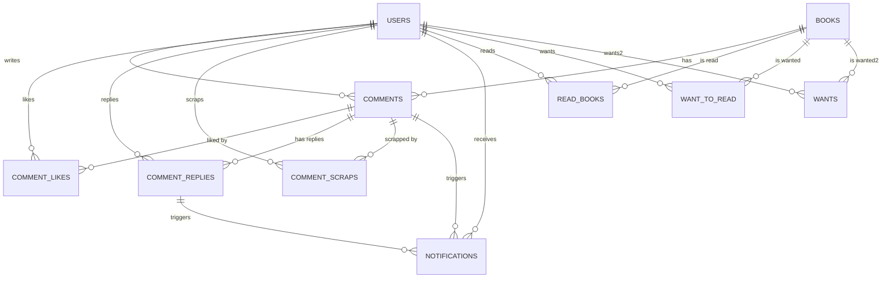

# Seoul Shelf 백엔드

책 추천, 리뷰, 알림 등 다양한 커뮤니티 기능을 제공하는 웹 서서비스의 백엔드입니다.  
Node.js와 Express, MySQL을 기반으로 하며, JWT 인증과 Swagger 기반 API 문서를 지원합니다.

---

## 목차
- [기술 스택](#기술-스택)
- [주요 기능](#주요-기능)
- [데이터베이스 스키마](#데이터베이스-스키마)
- [ER 다이어그램](#er-다이어그램)
- [API 문서](#api-문서)
- [실행 방법](#실행-방법)

---

## 기술 스택

- **런타임**: Node.js
- **프레임워크**: Express.js
- **데이터베이스**: MySQL
- **인증**: JWT (JSON Web Token)
- **문서화**: Swagger (OpenAPI)
- **기타 라이브러리**:
  - dotenv: 환경변수 관리
  - cors: CORS 정책 처리
  - mysql2: MySQL 연결 및 쿼리
  - bcrypt: 비밀번호 암호화
  - nodemon: 개발용 자동 재시작

---

## 주요 기능

### 1. 인증 및 사용자 관리
- JWT 기반 로그인/인증
- OAuth(구글 등) 지원
- 사용자 정보 조회

### 2. 도서 관리
- 인기 도서, 도서 검색, 상세 정보 제공
- 추천 도서(봄 추천 등) 제공

### 3. 코멘트/답글/좋아요/스크랩
- 책별 코멘트 작성, 수정, 삭제
- 코멘트에 답글 작성, 수정, 삭제
- 코멘트 좋아요/스크랩/읽고싶어요/읽었어요 관리
- 내 코멘트/답글/스크랩/읽고싶어요/읽었어요 조회

### 4. 알림 시스템
- 댓글, 답글, 좋아요 등 이벤트 발생 시 알림 생성
- 알림 읽음 처리 및 전체 읽음 처리

### 5. 통계 및 인기 기능
- 인기 도서, 인기 코멘트 등 집계 제공

---

## 데이터베이스 스키마

### 1. users
| 필드           | 타입           | 설명           | 제약조건                |
|----------------|---------------|----------------|-------------------------|
| id             | INT           | 사용자 ID      | PK, AUTO_INCREMENT      |
| oauth_id       | VARCHAR(255)  | OAuth ID       | UNIQUE, NOT NULL        |
| provider       | VARCHAR(20)   | OAuth 제공자   | NOT NULL                |
| email          | VARCHAR(255)  | 이메일         |                         |
| name           | VARCHAR(100)  | 이름           |                         |
| profile_image  | TEXT          | 프로필 이미지  |                         |
| created_at     | TIMESTAMP     | 생성일         | DEFAULT CURRENT_TIMESTAMP|

### 2. books
| 필드           | 타입           | 설명           | 제약조건                |
|----------------|---------------|----------------|-------------------------|
| id             | INT           | 책 ID          | PK, AUTO_INCREMENT      |
| title          | TEXT          | 제목           |                         |
| author         | TEXT          | 저자           |                         |
| publisher      | TEXT          | 출판사         |                         |
| publication_year| INT          | 출판년도       |                         |
| loan_count     | INT           | 대출 횟수      |                         |
| image_url      | VARCHAR(255)  | 이미지 URL     |                         |
| isbn           | VARCHAR(20)   | ISBN           |                         |

### 3. comments
| 필드           | 타입           | 설명           | 제약조건                |
|----------------|---------------|----------------|-------------------------|
| id             | INT           | 코멘트 ID      | PK, AUTO_INCREMENT      |
| user_id        | INT           | 작성자 ID      | FK(users.id), NOT NULL  |
| book_id        | INT           | 책 ID          | FK(books.id), NOT NULL  |
| content        | TEXT          | 내용           |                         |
| rating         | INT           | 평점           |                         |
| created_at     | DATETIME      | 작성일         | DEFAULT CURRENT_TIMESTAMP|
| updated_at     | TIMESTAMP     | 수정일         | DEFAULT CURRENT_TIMESTAMP ON UPDATE |

### 4. comment_likes
| 필드           | 타입           | 설명           | 제약조건                |
|----------------|---------------|----------------|-------------------------|
| id             | INT           | ID             | PK, AUTO_INCREMENT      |
| user_id        | INT           | 사용자 ID      | FK(users.id), NOT NULL  |
| comment_id     | INT           | 코멘트 ID      | FK(comments.id), NOT NULL|
| created_at     | DATETIME      | 생성일         | DEFAULT CURRENT_TIMESTAMP|

### 5. comment_replies
| 필드           | 타입           | 설명           | 제약조건                |
|----------------|---------------|----------------|-------------------------|
| id             | INT           | 답글 ID        | PK, AUTO_INCREMENT      |
| comment_id     | INT           | 코멘트 ID      | FK(comments.id), NOT NULL|
| user_id        | INT           | 작성자 ID      | FK(users.id), NOT NULL  |
| content        | TEXT          | 답글 내용      | NOT NULL                |
| created_at     | TIMESTAMP     | 작성일         | DEFAULT CURRENT_TIMESTAMP|

### 6. comment_scraps
| 필드           | 타입           | 설명           | 제약조건                |
|----------------|---------------|----------------|-------------------------|
| id             | INT           | 스크랩 ID      | PK, AUTO_INCREMENT      |
| user_id        | INT           | 사용자 ID      | FK(users.id), NOT NULL  |
| comment_id     | INT           | 코멘트 ID      | FK(comments.id), NOT NULL|
| created_at     | DATETIME      | 생성일         | DEFAULT CURRENT_TIMESTAMP|

### 7. notifications
| 필드           | 타입           | 설명           | 제약조건                |
|----------------|---------------|----------------|-------------------------|
| id             | INT           | 알림 ID        | PK, AUTO_INCREMENT      |
| user_id        | INT           | 수신자 ID      | FK(users.id), NOT NULL  |
| sender_id      | INT           | 발신자 ID      | FK(users.id), NOT NULL  |
| type           | VARCHAR(50)   | 알림 타입      | NOT NULL                |
| content_id     | INT           | 관련 컨텐츠 ID |                         |
| message        | TEXT          | 메시지         | NOT NULL                |
| read           | TINYINT(1)    | 읽음 여부      | DEFAULT 0               |
| created_at     | TIMESTAMP     | 생성일         | DEFAULT CURRENT_TIMESTAMP|

### 8. read_books
| 필드           | 타입           | 설명           | 제약조건                |
|----------------|---------------|----------------|-------------------------|
| id             | INT           | ID             | PK, AUTO_INCREMENT      |
| user_id        | INT           | 사용자 ID      | FK(users.id), NOT NULL  |
| book_id        | INT           | 책 ID          | FK(books.id), NOT NULL  |
| created_at     | DATETIME      | 생성일         | DEFAULT CURRENT_TIMESTAMP|

### 9. want_to_read
| 필드           | 타입           | 설명           | 제약조건                |
|----------------|---------------|----------------|-------------------------|
| id             | INT           | ID             | PK, AUTO_INCREMENT      |
| user_id        | INT           | 사용자 ID      | FK(users.id), NOT NULL  |
| book_id        | INT           | 책 ID          | FK(books.id), NOT NULL  |
| created_at     | DATETIME      | 생성일         | DEFAULT CURRENT_TIMESTAMP|

### 10. wants
| 필드           | 타입           | 설명           | 제약조건                |
|----------------|---------------|----------------|-------------------------|
| id             | INT           | ID             | PK, AUTO_INCREMENT      |
| user_id        | INT           | 사용자 ID      | FK(users.id), NOT NULL  |
| book_id        | INT           | 책 ID          | FK(books.id), NOT NULL  |
| created_at     | TIMESTAMP     | 생성일         | DEFAULT CURRENT_TIMESTAMP|

---

## ER 다이어그램



---

## API 문서

- Swagger(OpenAPI) 기반 문서 제공  
- `/api-docs` 경로에서 전체 API 명세 확인 가능

### 인증
- `POST /auth/login` - 로그인
- `POST /auth/logout` - 로그아웃

### 도서
- `GET /books/popular` - 인기 도서 조회
- `GET /books/search?q=검색어` - 도서 검색
- `GET /books/:id` - 도서 상세 정보
- `GET /spring-books` - 봄 추천 도서

### 코멘트
- `POST /comments` - 코멘트 작성
- `PUT /comments/:id` - 코멘트 수정
- `DELETE /comments/:id` - 코멘트 삭제
- `GET /comments/:bookId` - 특정 책의 코멘트 목록 조회
- `GET /my-comments` - 내가 쓴 코멘트 목록 조회
- `POST /comments/:commentId/like` - 좋아요 토글
- `DELETE /comments/:commentId/like` - 좋아요 취소
- `GET /comments/:commentId/like-count` - 좋아요 수 조회
- `POST /comments/:commentId/reply` - 답글 작성
- `PUT /comment-replies/:replyId` - 답글 수정
- `DELETE /comment-replies/:replyId` - 답글 삭제
- `GET /my-replies` - 내가 쓴 답글 목록 조회
- `POST /comment-scraps/:commentId` - 코멘트 스크랩
- `DELETE /comment-scraps/:commentId` - 스크랩 취소
- `GET /my-scraps` - 내 스크랩 목록 조회

### 읽고싶어요/읽었어요
- `POST /want-to-read/:bookId` - 읽고싶어요 등록
- `DELETE /want-to-read/:bookId` - 읽고싶어요 취소
- `GET /my-wants` - 내가 읽고싶어요 등록한 책 목록
- `POST /read-books/:bookId` - 읽었어요 등록
- `DELETE /read-books/:bookId` - 읽었어요 취소
- `GET /my-reads` - 내가 읽은 책 목록

### 알림
- `GET /notifications` - 내 알림 목록 조회
- `PATCH /notifications/:notification_id` - 알림 읽음 처리
- `PATCH /notifications/read-all` - 전체 알림 읽음 처리

### 통계/인기
- `GET /popular-books` - 인기 도서 목록
- `GET /popular-comments` - 인기 코멘트 목록

---

## 실행 방법

1. `.env` 파일에 환경변수(DB 정보, JWT 시크릿 등) 설정
2. MySQL DB 및 테이블 생성
3. 의존성 설치
    ```bash
    npm install
    ```
4. 서버 실행
    ```bash
    npm start
    ```
5. Swagger API 문서 확인
    - [http://localhost:포트번호/api-docs](http://localhost:포트번호/api-docs)

---

## 기타

- 모든 주요 API는 JWT 인증 필요
- Swagger 문서로 API 테스트 가능
- DB 스키마 및 코드 구조는 확장/유지보수에 용이하게 설계

---

## 서비스 링크
프론트 깃허브 링크 - https://github.com/SeoulDataHub/main
서비스 URL - https://seoulshelftest.vercel.app/

**문의 및 개선 요청은 언제든 환영합니다!**